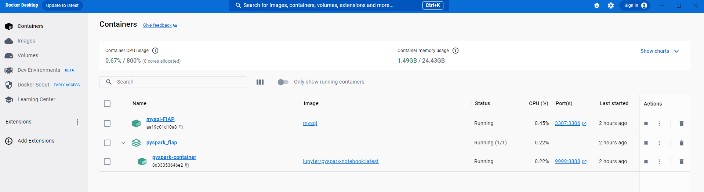
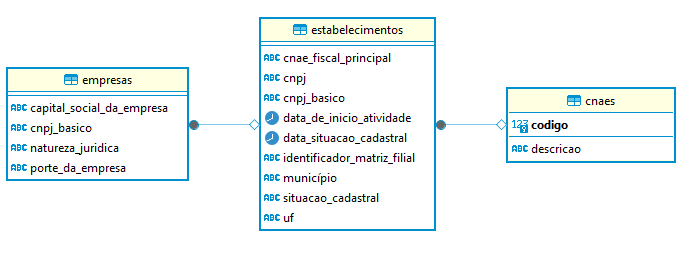
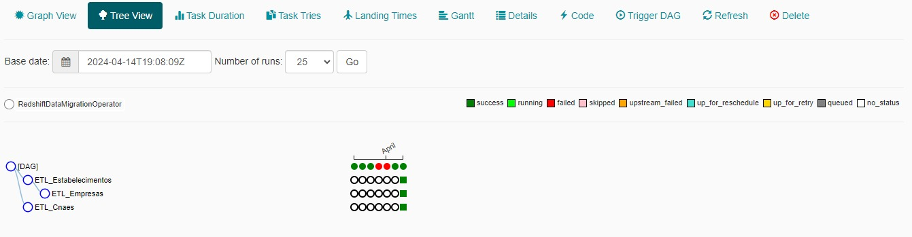
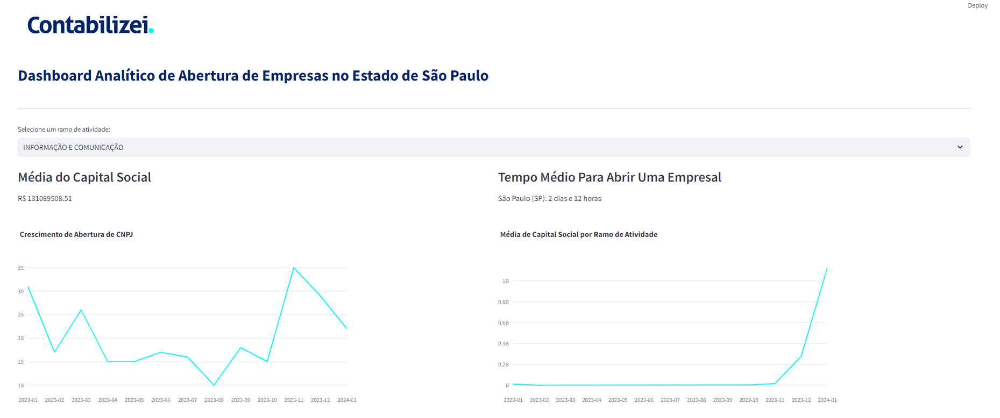
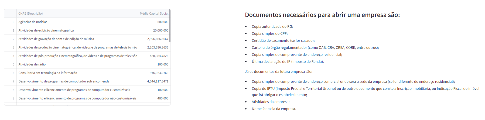
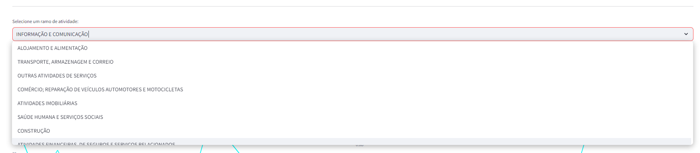

# Índice

* [Visão Geral](#Visão_Geral)
* [Ferramentas Utilizadas](#Ferramentas_Utilizadas)
* [Utilização dos Dados](#Utilização_Dados)
* [Configuração do Ambiente](#Configuração_Ambiente)
* [Utilização das Ferramentas](#Utilização_Ferramentas)
* [Funcionalidades Principais](#Funcionalidades_Principais)
* [Scripts Desenvolvidos](#Scripts_Desenvolvidos)
* [Fluxo de Funcionamento](#Fluxo_Funcionamento)
* [Resultado Dashboard](#Resultado_Dashboard)
* [Conclusão](#Conclusão)

# Documentação do Projeto: Enterprise Challenge: Sprint 3 - MVP PRELIMINAR

## Visão Geral:
O projeto tem como objetivo auxiliar os clientes da Contabilizei durante o processo de abertura de uma empresa, fornecendo insights essenciais por meio da análise e visualização de dados relacionados a empresas. Isso inclui informações cruciais sobre estabelecimentos, natureza jurídica, capital social e ramo de atividade. Para alcançar esse objetivo, diversos scripts foram desenvolvidos para extrair dados de diferentes fontes, como arquivos CSV, bancos de dados MySQL e armazenamento na nuvem AWS S3. Os dados extraídos foram processados, armazenados e visualizados utilizando uma combinação de bibliotecas Python e ferramentas de análise de dados. O projeto visa fornecer aos clientes da Contabilizei insights fundamentais que os ajudem a tomar decisões informadas durante o processo de abertura de uma empresa.

[Voltar](#Indice)

 

## Utilização dos Dados
Para este projeto foram utilizados os dados:

* **cnaes**, **empresas** e **estabelecimentos** do site [Dados Abertos]( https://dados.gov.br/dados/conjuntos-dados/cadastro-nacional-da-pessoa-juridica---cnpj).

* **cnaes-subclasses. 2.3** do site [cnae.ibge](https://cnae.ibge.gov.br/?view=estrutura).

* **Artigo** "Quanto tempo leva para abrir minha empresa em 2024" do site [contabilizei](https://www.contabilizei.com.br/contabilidade-online/quanto-tempo-leva-para-abrir-uma-empresa/?utm_device=c&utm_term=&utm_source=google&utm_medium=cpc&utm_campaign=%5BMAX%5D_Performance_RMKT_Vendas&hsa_cam=20859898068&hsa_grp=&hsa_mt=&hsa_src=x&hsa_ad=&hsa_acc=1466761651&hsa_net=adwords&hsa_kw=&hsa_tgt=&hsa_ver=3&gad_source=1&gclid=Cj0KCQjwlN6wBhCcARIsAKZvD5jvTi4-tapqzrFGQbO54HZ98-j-14qVGzmvx8epFYjzrqiXfiv2HXwaAm_rEALw_wcB#quanto-tempo-demora-para-abrir-uma-empresa).

* **Artigo** "Documentação para abrir empresa: saiba o que é solicitado durante o proceso" do site [contabilizei](https://www.contabilizei.com.br/contabilidade-online/documentacao-para-abrir-empresa-saiba-o-que-e-solicitado-durante-o-processo/).

[Voltar](#Indice)

 
## Ferramentas Utilizadas:

* Linguagem de Programação: Python.
* Bibliotecas Principais: Pandas, PySpark, mysql.connector, boto3, Streamlit Plotly Express.
* Banco de Dados: MySQL.
* Armazenamento de Dados: AWS S3 para arquivos de dados.
* Plataforma de Orquestração de Fluxo de Trabalho: Apache Airflow.

[Voltar](#Indice)

 
## Configuração do Ambiente

 Configuração do ambiente para este projeto envolve a utilização de diversas ferramentas para criar um ambiente de desenvolvimento local robusto e eficiente. Neste contexto, Docker foi escolhido como a principal ferramenta para criar e gerenciar contêineres isolados que hospedam as aplicações necessárias, como pyspark e MySQL. Esta abordagem proporciona um ambiente de desenvolvimento consistente e portátil, eliminando a necessidade de configurar manualmente cada componente do sistema.

[Voltar](#Indice)

 
### Utilização das Ferramentas:
* **Docker:**
Docker é uma plataforma de código aberto que automatiza o processo de implantação de aplicativos em contêineres. Ele fornece uma maneira de empacotar aplicativos com todas as suas dependências em contêineres isolados, garantindo que eles funcionem da mesma forma em qualquer ambiente. Neste projeto, Docker é usado para criar e gerenciar contêineres para pyspark e MySQL.

* **pyspark:**
pyspark é uma biblioteca Python para processamento de dados distribuído usando o framework Apache Spark. Ele fornece uma API amigável para trabalhar com grandes conjuntos de dados e realizar análises de dados distribuídas. No contexto deste projeto, pyspark é utilizado para processar e analisar os dados relacionados a empresas.

* **MySQL:** MySQL é um sistema de gerenciamento de banco de dados relacional de código aberto. Ele é amplamente utilizado para armazenar e gerenciar dados estruturados. Neste projeto, MySQL é utilizado para armazenar os dados relacionados a empresas que serão processados e analisados pelo pyspark.
#### Modelo Relacional 

#### Este diagrama fornece uma visão clara das tabelas envolvidas no modelo relacional e das relações entre elas.

**Tabela cnaes:**

* PK (codigo): A chave primária é a coluna codigo, que identifica exclusivamente cada registro na tabela cnaes. Ela é usada para garantir que cada CNAE tenha um identificador único.

**Tabela empresas:**

* PK (cnpj_basico): A chave primária é a coluna cnpj_basico, que identifica exclusivamente cada registro na tabela empresas. Ela é usada para garantir que cada empresa tenha um identificador único.
* FK (cnpj_basico em estabelecimentos): A coluna cnpj_basico é uma chave estrangeira na tabela estabelecimentos, que faz referência à coluna cnpj_basico na tabela empresas. Isso estabelece uma relação entre as tabelas, permitindo que os estabelecimentos sejam associados às empresas correspondentes.

**Tabela estabelecimentos:**

* PK (cnpj): A chave primária é a coluna cnpj, que identifica exclusivamente cada registro na tabela estabelecimentos. Ela é usada para garantir que cada estabelecimento tenha um identificador único.
* FK (cnpj_basico em empresas): A coluna cnpj_basico é uma chave estrangeira na tabela estabelecimentos, que faz referência à coluna cnpj_basico na tabela empresas. Isso estabelece uma relação entre as tabelas, permitindo que os estabelecimentos sejam associados às empresas correspondentes.
* FK (cnae_fiscal_principal em cnaes): A coluna cnae_fiscal_principal é uma chave estrangeira na tabela estabelecimentos, que faz referência à coluna codigo na tabela cnaes. Isso estabelece uma relação entre as tabelas, permitindo que os estabelecimentos sejam associados aos CNAEs correspondentes.

#### Para configurar o ambiente utilizando Docker sigo o passo a passo do Script: [Script caminho.py](scripts/caminho.py) ####

### Apache Airflow: 
Apache Airflow é uma plataforma de código aberto para orquestração de fluxos de trabalho. Ele permite programar a execução de tarefas de forma automatizada e escalável, facilitando a gestão e o monitoramento de pipelines de dados. No contexto deste projeto, o Apache Airflow é utilizado para agendar e executar os scripts de extração, transformação e carga de dados de forma regular e automatizada.

[Voltar](#Indice)

## Funcionalidades Principais: ## 

#### 1.	Extração e Transformação de Dados: #
* Utilização das bibliotecas Pandas, PySpark e mysql.connector para extrair dados de diferentes fontes e realizar transformações necessárias para a análise.  

#### 2.	Processamento de Dados com Spark:
*	Uso do Spark para processar grandes volumes de dados de forma eficiente, incluindo renomeação de colunas, ajustes de dados e junção de conjuntos de dados.

#### 3.	Armazenamento de Dados:
*	Utilização do banco de dados MySQL para armazenar os dados processados, com operações de criação de banco de dados, tabelas e inserção de dados.

#### 4.	Visualização de Dados:
*	Criação de um dashboard interativo com o Streamlit, permitindo aos usuários selecionar filtros e visualizar diferentes gráficos e tabelas.

*	Utilização do Plotly Express para gerar gráficos interativos, incluindo gráficos de linha, de barras e de dispersão.

#### 5. Orquestração de Fluxo de Trabalho:

* Uso do Apache Airflow para programar a execução automatizada dos scripts conforme um cronograma definido. Isso garante a regularidade das operações e oferece monitoramento detalhado das execuções para identificar possíveis problemas.

[Voltar](#Indice)

## Scripts Desenvolvidos:

## 1.	Script 1: Análise de Estabelecimentos: 
*	Extração e tratamento de dados de estabelecimentos.
*	Utilização do Spark para processar e filtrar os dados.
*	Salvamento dos dados tratados no banco de dados MySQL.

#### Script: [Script Estabelecimentos.py](scripts\estabelecimentos.py)

## 2.	Script 2: Análise de Empresas: 
*	Extração e tratamento de dados de empresas.
*	Junção dos dados de empresas com os dados de estabelecimentos.
*	Salvamento dos dados no banco de dados MySQL.

#### Script: [Script Empresas.py](scripts\empresas.py)

## 3.	Script 3: Análise de Ramos de Atividade (CNAEs): 

*	Extração e tratamento de dados dos códigos CNAE.
*	Salvamento dos dados no banco de dados MySQL.

#### [Script cnaes.py](scripts\cnaes.py)

## 4.	Script 4: Dashboard Interativo: 
*	Utilização do Streamlit para criar um dashboard interativo.
*	Visualização dos dados processados em gráficos e tabelas interativas.

#### [Script visualizacao.py](scripts\visualizacao.py)

## 5.	Script 5: Configuração do Ambiente: 
* Define o caminho geral onde estão localizados os arquivos.
* Carrega o layout dos dados a partir de um arquivo JSON.
* Cria uma sessão Spark para processamento de dados.

#### [Script visualizacao.py](README.md)

[Voltar](#Indice)

## 

## Fluxo de Funcionamento: ##
1.	Os scripts são executados sequencialmente para extrair, transformar e carregar os dados nas etapas necessárias.

2.	Os dados são processados e armazenados no banco de dados MySQL e S3 para posterior análise.

3.	O dashboard interativo é disponibilizado aos usuários finais para explorar os dados e obter insights relevantes sobre empresas e seus estabelecimentos.

[Voltar](#Indice)

# Resultado Dashboard

#### O Dashboard foi projetado para fornecer uma visão abrangente do cenário de abertura de empresas no Estado de São Paulo, apresentando dados relevantes sobre o capital social, o tempo médio para abrir uma empresa, a evolução da abertura de CNPJ ao longo do tempo e a média de receita por ramo de atividade.

### Insights Fornecidos pelo Dashboard:

* Média do Capital Social: Os clientes podem visualizar a média do capital social das empresas em um determinado ramo de atividade. Isso pode ajudá-los a entender o investimento médio necessário para iniciar uma empresa em uma área específica.

* Tempo Médio Para Abrir Uma Empresa: Os clientes podem obter informações sobre o tempo médio necessário para abrir uma empresa no estado de São Paulo. Isso é útil para estimar prazos e planejar o início das operações comerciais.

* Evolução da Abertura de CNPJ por Período: Os clientes podem acompanhar a evolução da abertura de CNPJ ao longo do tempo, permitindo-lhes identificar tendências de crescimento ou declínio na criação de novas empresas em um determinado período.

* Média de Receita por Ramo de Atividade: Os clientes podem visualizar a média de capital social por ramo de atividade, o que pode ajudá-los a entender a dinâmica financeira de diferentes setores e identificar oportunidades de investimento.

Além disso, o dashboard fornece informações sobre os documentos necessários para abrir uma empresa, o que é valioso para os clientes que estão no processo de iniciar um negócio. Essa seção fornece uma lista detalhada dos documentos exigidos, ajudando os clientes a se prepararem adequadamente para o processo de abertura da empresa.

Com esses insights, os clientes podem tomar decisões mais informadas sobre questões como investimento, prazos e requisitos regulatórios ao iniciar ou expandir seus negócios.

[Voltar](#Indice)

## Conclusão: ##
O projeto proporciona uma análise detalhada e visualização intuitiva dos dados de empresas, permitindo aos usuários explorar informações importantes sobre estabelecimentos, natureza jurídica, capital social e ramo de atividade. O uso de ferramentas como Pandas, PySpark, Streamlit e Plotly Express facilita a análise e a tomada de decisões com base nos dados disponíveis.

[Voltar](#Indice)